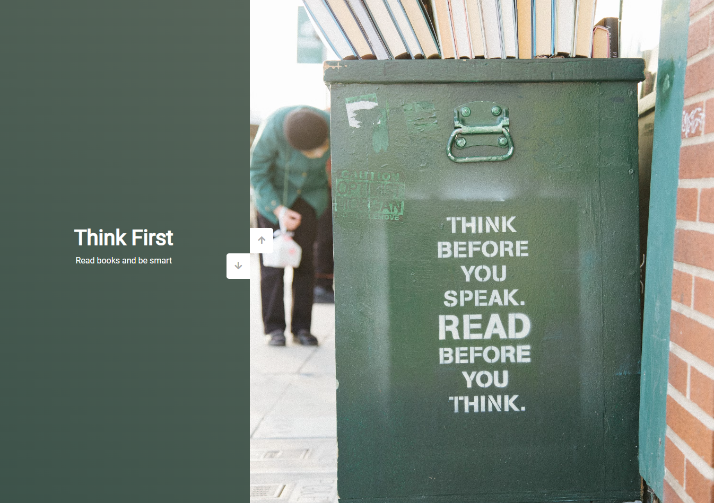

# Slider with photos

Build with vanilla javascript and css transitions for animation

Images and sidebar move vice-versa 

Code chunk 

```javascript
sidebar.style.transform = `translateY(${activeSlideIndex * 100}vh)`
mainSlide.style.transform = `translateY(-${activeSlideIndex * 100}vh)`
```

Screenshot 

